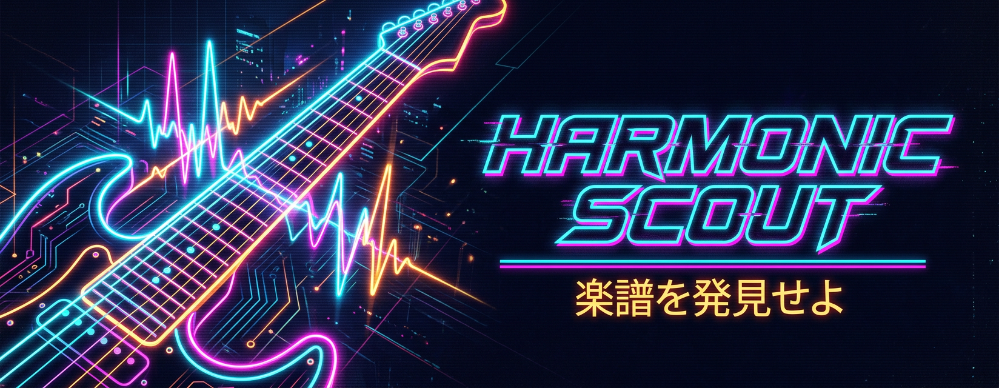

<div align="center">



# 🎸 Harmonic Scout

**Cyberpunk / Akira-Style Gitarren-Trainer** — Live-Tonerkennung, Lick-Training, Improvisation, Gehörbildung & Design-Switcher in einer lokal laufenden Web-App.

*"楽譜を発見せよ — Finde das Notenblatt."*

    

</div>

---

## ✨ Was ist Harmonic Scout?

Harmonic Scout ist ein **interaktives Improvisations-Studio für Gitarre**, gebaut als moderne Web-App mit Retro-Sync-/Neon-Ästhetik. Du spielst eine Note, die App erkennt sie **live über das Mikrofon** und führt dich mit Fretboards, Tonart-/Skala-Analyse und spielerischen Trainingsmodulen zu mehr Sicherheit und Tempo.

Alles läuft **lokal im Browser** — kein Server, kein Backend, keine Cloud-Pflicht. Fortschritt, XP und Streak werden lokal gespeichert.

## 🚀 Kernfunktionen

| Modul | Was es macht |
| --- | --- |
| **Lick-Trainer** | Lick anhören, Noten/Tabs sehen, mit dem Mikrofon nachspielen. Tempo steigt nur bei korrekter Note + sauberem Timing. |
| **Lick-Bibliothek** | Fertige Licks für Blues, Rock, Jazz, Folk, Metal & Reggae — mit Genre-Filter, Vorspiel und direktem Sprung in den Trainer. |
| **Improvisations-Coach** | Live-Tonart- & Skalaerkennung, Fretboard-Führung, Challenge mit Tempo-Ramp. |
| **Rhythm-Guitar Coach** | Passende Akkorde, Klangbeispiele, Guide-Tone-Routing, Position-Lens und Live-Check. |
| **Rhythm Jam** | Timing gegen Metronom, adaptives Tempo, auditive Feedback-Blips. |
| **Theorie-Quiz** | Intervalle, Skalen & Akkorde spielerisch abfragen — mit Erklärung und XP. |
| **Gehörbildung** | Note / Intervall / Akkord hören und erkennen, mit Tone.js Playback. |
| **Design-Lab** | 7 direkt interaktive Theme-Prototypen (Neo-Tokyo, Vaporwave, Retro-CRT, Midnight-Jazz, Miami, Inferno Red, Aurora Ice) — ein Klick färbt die ganze App um. |

## 🎯 Besonderheiten

- **🎨 Direkt interaktive Designs** — 7 Themes, jederzeit über Farbpunkte im Header umschaltbar.
- **🎵 Auditives Feedback** — Ton-Blips für richtig/falsch/zu früh/zu spät (Tone.js).
- **📈 Adaptives Tempo** — wird bei Fehlern gesenkt, bei Erfolg erhöht.
- **📄 PDF-Import (Text-Ebene)** — digitale Tabs/Noten mit Textschicht einlesen; kein OCR/Scan.
- **🎸 Echte Akkord-Griffbilder** — String-/Fret-Diagramme im Coach.
- **📊 Session-Export** — Fortschritt als JSON downloaden oder als Lernkarte kopieren.
- **🏆 Lokale Gamification** — XP, Level, Streak, Sterne, Fortschritt.

## 🧠 Architektur & Technik

- **React 19 + TypeScript + Vite**
- **Web Audio / Autokorrelation** für latenzarme Tonhöhen- & Akkorderkennung
- **Tone.js** für Synthesizer-Playback, Metronom und Feedback
- **pdfjs-dist** für die Text-Ebene des PDF-Imports
- **@google/genai** optionale musikalische Kontext-Analyse (Gemini)

```
App.tsx                  → App-Shell, Mikrofon-Loop, Themes, Navigation
modules/                 → Lick-Trainer, Studios, Quiz, Gehörbildung, Design-Lab
core/                    → Licks, Harmonie, Themes, Songs, Quiz, Ear, Export, Sound
core/audio.ts            → einzige Pitch-Detektion (NSDF + parabolische Interpolation)
components/              → Fretboards, Akkord-Diagramme, Visualizer, ErrorBoundary
tests/                   → Unit-Tests der reinen Logik (Vitest)
.agent/plans.json        → Single Source of Truth der Agenten-Koordination
scripts/agent-coordination.mjs → CLI für Pläne & Konflikte
```

**Tonhöhen-Erkennung:** `core/audio.ts` ist die einzige Implementierung und
wird von der Analyse-Ansicht und allen Trainings-Modulen geteilt. Sie nutzt
die normalisierte Differenzfunktion (NSDF) und wählt die *kürzeste* Periode,
die nahe am Bestwert liegt — damit gibt es keine Oktav-/Quint-Sprünge mehr bei
gehaltenen Tönen.

## 🚦 Installation & Start

**Voraussetzungen:** Node.js 18+

```bash
npm install
npm run dev      # Entwicklungs-Server → http://localhost:3000
```

Optional (musikalische Analyse): `GEMINI_API_KEY` in `.env.local` setzen.
Ohne Key läuft alles außer der KI-Analyse — die App sagt das dann im UI.

Produktions-Build:

```bash
npm run build
npm run preview
```

Qualitätssicherung:

```bash
npm run typecheck   # tsc --noEmit (strict)
npm run test        # Vitest, Unit-Tests für core/ (Audio, Theorie, Matching, Fortschritt …)
npm run verify      # typecheck + test + build
```

Tests liegen in `tests/`, die CI (`.github/workflows/ci.yml`) führt alle drei
Schritte bei jedem Push aus.

## 🧭 Nächste Schritte

Eine priorisierte Liste offener Punkte (inkl. bekannter Baustellen wie
Tailwind-CDN und API-Key im Client-Bundle) liegt in
[`docs/next-steps.md`](docs/next-steps.md).

## 🗺️ Roadmap / Status

Alle aktuell geplanten Module sind **online**:

- [x] Module Hub + Lick-Trainer (PDF & Mikrofon)
- [x] Improvisations-Coach (Live-Key, Fretboard, Tempo-Ramp)
- [x] Rhythm Jam / Rhythm-Guitar Coach
- [x] Reale Akkord-Griffbilder & Position Finder
- [x] Song-Fake-Book, Guide-Tone-Routing, Position-Lens
- [x] Theorie-Quiz & Gehörbildung
- [x] Lick-Bibliothek & direkt interaktive Design-Prototypen

## 🤝 Agenten-Koordination

Das Repo hat eine eingebaute Koordinationsschicht für parallele Agenten:

- **Machine-readable Single Source of Truth:** `.agent/plans.json`
- **Dashboard:** `docs/agent-coordination.md`
- **Protokoll:** `AGENTS.md`
- **CLI:** `scripts/agent-coordination.mjs`

```bash
node scripts/agent-coordination.mjs announce --agent ui-craftsman --plan "..." --files "..."
node scripts/agent-coordination.mjs update --plan PLAN-012 --status done
node scripts/agent-coordination.mjs status
node scripts/agent-coordination.mjs dashboard
```

---

<div align="center">

**Harmonic Scout** · NEO•TOKYO//SOUND.LAB · Retro-Sync meets Guitar Practice 🎸⚡

</div>
